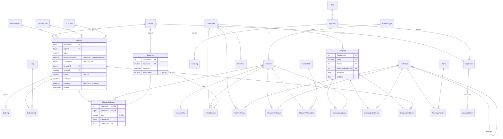
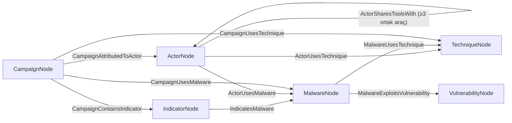

# İlişkisel şema (çekirdek)

GitHub bu diyagramı doğrudan çizer (Mermaid). Tüm tablolar ve sütunlar için `docs/veritabani_nesneleri.md`.

```mermaid
erDiagram
    Source ||--o{ Indicator : "bildirir"
    Source ||--o{ Evidence : "dayanak"
    Source ||--o{ ImportJob : "çeker"
    IndicatorType ||--o{ Indicator : "tip"
    SeverityLevel ||--o{ Indicator : "önem"
    TLPLevel ||--o{ Indicator : "paylaşım"
    AppUser ||--o{ ImportJob : "başlatır"
    AppUser ||--o{ AuditLog : "değiştirir"
    Role ||--o{ AppUser : "rol"
    Indicator ||--o{ Sighting : "görülme"
    Indicator ||--o{ IndicatorTag : ""
    Tag ||--o{ IndicatorTag : ""
    Indicator ||--o{ MalwareIndicator : ""
    Malware ||--o{ MalwareIndicator : ""
    Malware ||--o{ MalwareAlias : ""
    MalwareType ||--o{ Malware : "tür"
    ThreatActor ||--o{ ActorAlias : ""
    ThreatActor ||--o{ ActorMalware : ""
    Malware ||--o{ ActorMalware : ""
    ThreatActor ||--o{ ActorTechnique : ""
    Technique ||--o{ ActorTechnique : ""
    Malware ||--o{ MalwareTechnique : ""
    Technique ||--o{ MalwareTechnique : ""
    Malware ||--o{ MalwareVulnerability : ""
    Vulnerability ||--o{ MalwareVulnerability : ""
    ThreatActor |o--o{ Campaign : "atfedilir"
    Campaign ||--o{ CampaignMalware : ""
    Campaign ||--o{ CampaignTechnique : ""
    Campaign ||--o{ CampaignIndicator : ""
    Malware ||--o{ CampaignMalware : ""
    Technique ||--o{ CampaignTechnique : ""
    Indicator ||--o{ CampaignIndicator : ""
    Technique |o--o{ Technique : "üst teknik"
    Technique ||--o{ TechniqueTactic : ""
    Tactic ||--o{ TechniqueTactic : ""
    Evidence |o--o{ MalwareIndicator : "kanıt"
    Evidence |o--o{ ActorMalware : "kanıt"
    ImportJob ||--o{ ImportJobError : "hatalı satır"

    Indicator {
        bigint IndicatorID PK
        tinyint TypeID FK
        nvarchar Value
        nvarchar NormalizedValue "UQ(TypeID, NormalizedValue)"
        tinyint Confidence "CHECK 0-100"
        tinyint SeverityID FK
        smallint SourceID FK
        varchar Status "CHECK"
        datetime2 FirstSeen
        datetime2 LastSeen "CHECK >= FirstSeen"
        rowversion RowVer
    }
    MalwareIndicator {
        int MalwareID PK, FK
        bigint IndicatorID PK, FK
        varchar Role "CHECK"
        tinyint Confidence
        int EvidenceID FK
    }
    Evidence {
        int EvidenceID PK
        smallint SourceID FK
        nvarchar Summary
        varchar ExternalRef "UQ (filtreli)"
    }
    Campaign {
        int CampaignID PK
        nvarchar Name UK
        int ActorID FK
        int AttributionEvidenceID FK
        date StartDate
        date EndDate
    }
```

## SQL Graph katmanı

```mermaid
flowchart LR
    IndicatorNode -- IndicatesMalware --> MalwareNode
    ActorNode -- ActorUsesMalware --> MalwareNode
    ActorNode -- ActorUsesTechnique --> TechniqueNode
    MalwareNode -- MalwareUsesTechnique --> TechniqueNode
    MalwareNode -- MalwareExploitsVulnerability --> VulnerabilityNode
    CampaignNode -- CampaignAttributedToActor --> ActorNode
    CampaignNode -- CampaignUsesMalware --> MalwareNode
    CampaignNode -- CampaignUsesTechnique --> TechniqueNode
    CampaignNode -- CampaignContainsIndicator --> IndicatorNode
    ActorNode -- "ActorSharesToolsWith (≥3 ortak araç)" --> ActorNode
```
